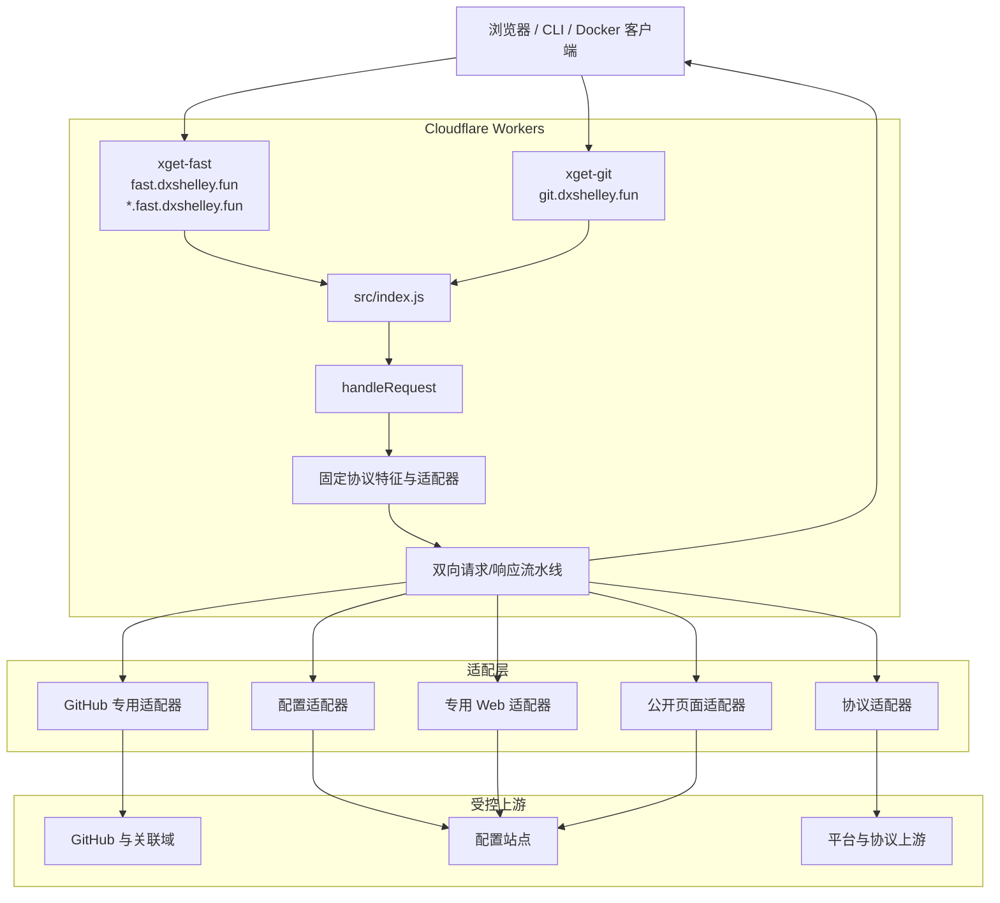
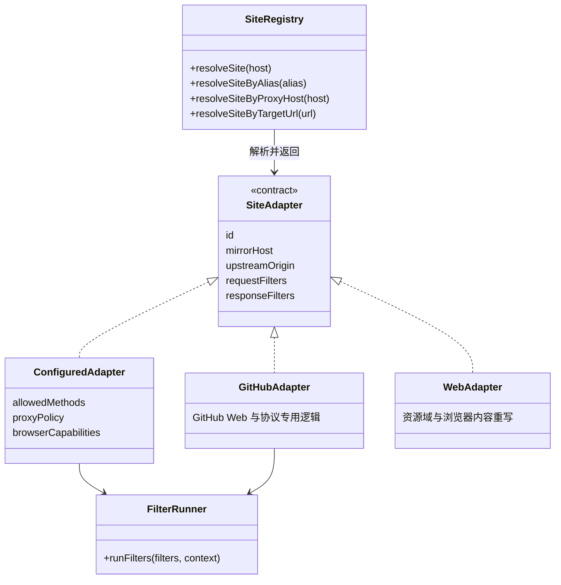
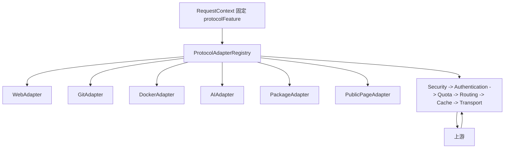
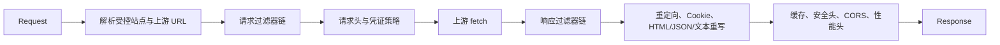
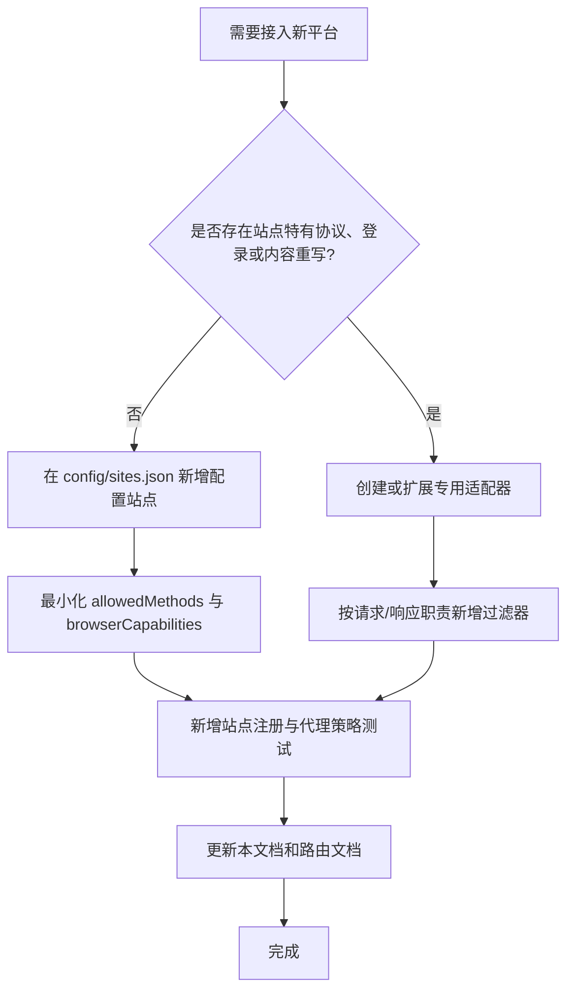

# Xget 架构规范

本文档定义 Xget 当前及后续演进的架构边界。新增平台、路由、代理能力和部署方式必须遵循本文档；若确有必要偏离，必须同时更新本文档、相关测试与站点配置。

## 1. 目标与边界

Xget 是运行在 Cloudflare
Workers 上的多协议、分站点代理系统。它有两条明确的产品边界：

- `fast.dxshelley.fun`
  是通用开发资源平台代理，保留原有平台前缀路由与隔离站点入口。
- `git.dxshelley.fun`
  是 GitHub 的专用透明镜像，路径与 GitHub 原站自然一致，不使用 `/gh` 前缀。

系统代理已注册的上游站点和协议；自动公开页面是唯一例外，只能在显式关闭 target allowlist 后访问无凭证的公开 HTTPS Origin，并固定为匿名 `public-page` 适配器。所有上游映射都必须来自平台配置、站点注册表或专用适配器，不能形成可携带凭证的开放代理。

## 2. 总体架构



`src/app/handle-request.js`
是唯一的应用级请求入口。它只负责创建请求上下文并执行双向流水线：

1. `src/app/request-feature.js` 在入口先按系统端点、注册站点 Host 与 `?target=`
   的已登记 Origin 确定路由所有权；已注册的浏览器站点、已登记目标和
   `/__xget/auth/*` 固定为 `web`。启用 `PAGE_MAP` 且显式关闭 target
   allowlist 时，未登记的公开 HTTPS 目标和已生成页面 Host 固定为
   `public-page`。其余通用平台请求再由协议注册表识别
   `git`、`docker`、`ai`、`huggingface` 或 `package`，并把对应适配器固定到
   `RequestContext`。
2. 请求正向经过认证、配额、预检、站点路由、协议路由、校验、目标解析、缓存和传输节点。
3. 上游响应沿已进入的节点反向返回，统一应用缓存写入、CORS、安全头和性能头。

任何新能力应先判断它属于既有分发分支中的哪一个，不能绕过 `handleRequest`
直接建立新的全局代理入口。

## 3. 路由与部署拓扑

| Worker          | 域名范围                                     | 职责                                       | 部署命令               |
| --------------- | -------------------------------------------- | ------------------------------------------ | ---------------------- |
| `xget-fast`     | `fast.dxshelley.fun`、`*.fast.dxshelley.fun` | 通用平台前缀、配置站点和 Web 适配器        | `npm run deploy:fast`  |
| `xget-git`      | `git.dxshelley.fun`                          | GitHub 全站透明镜像                        | `npm run deploy:git`   |
| `quota-gateway` | `door.dxshelley.fun`                         | 账户共享免费额度校准与 Durable Object 账本 | `npm run deploy:quota` |

`wrangler.toml` 以默认环境定义 `xget-fast`，以 `env.git` 定义
`xget-git`；`quota-gateway/wrangler.toml`
定义独立的限额 Worker。`npm run deploy` 必须顺序部署三个 Worker。

GitHub Actions 的 `workers.yml` 是唯一自动部署工作流：主分支的 CI 成功后执行
`npm run deploy`，依次发布 `xget-fast`、`xget-git` 和
`quota-gateway`。其他平台的同步、Pages、Netlify、Vercel 和镜像发布工作流只保留手动触发，不能重新引入自动
`workflow_run`，除非明确恢复该平台的自动发布策略。

## 4. 适配器架构



### 4.1 站点注册表

`src/proxy/site-registry.js` 是站点解析的单一可信来源。它从 `config/sites.json`
构建不可变站点定义，并提供以下安全映射：

- 镜像 Host 到站点。
- 稳定别名到配置站点。
- 隔离子域名 `<alias>.fast.dxshelley.fun` 到配置站点。
- 已注册的 HTTPS 上游 Origin 到配置站点或浏览器站点。

不得通过用户输入的完整 URL 直接转发。`resolveSiteByTargetUrl`
只接受已注册、无用户名和密码的 HTTPS Origin。

### 4.2 配置适配器

没有站点特有逻辑时，应只修改 `config/sites.json`。每个配置站点至少定义：

- `id`：稳定、不可复用的站点标识。
- `alias`：隔离子域名使用的别名。
- `mirrorHost` 与 `upstreamOrigin`：一对一映射。
- `allowedMethods`：默认采用最小方法集合。
- `proxyPolicy`：路径范围、超时和安全方法重试次数。
- `browserCapabilities`：凭证转发、OAuth、同源重定向重写、Service
  Worker、WebSocket 等能力开关。

能力开关默认关闭。需要凭证、OAuth、Service
Worker 或 WebSocket 的站点必须转为专用适配器，或以专门过滤器和完整回归测试显式启用，不能因为“接近透明”而默认放开。

### 4.3 专用适配器

站点具有以下任一特性时，必须新增或扩展专用适配器，而不是在通用核心堆叠条件判断：

- 多上游资源域、嵌入式 URL 或前端运行时动态请求。
- 登录、Cookie、OAuth、CSRF、跨域重定向或安全策略重写。
- WebSocket、Service Worker、SSE、Git Smart HTTP、Docker Registry 等协议行为。
- 上游反滥用、风控、速率限制或缓存语义。

GitHub 是专用适配器的参考实现。其逻辑集中在
`src/github/`，不得复制到通用路由层。

### 4.4 协议策略适配器与双向流水线



`src/protocol-adapters/` 是协议差异的唯一归属。`ProtocolAdapterRegistry`
在入口选中一个策略；认证、路径规范化、请求头、Docker 重试/重定向、缓存资格和协议响应语义均由该适配器提供。过滤器只处理自己的单一阶段，不直接按协议路径分支。

| 请求类型                                   | 认证适配器     | 未认证行为                         |
| ------------------------------------------ | -------------- | ---------------------------------- |
| 认证端点 `/__xget/auth/*`                  | 浏览器认证端点 | 由端点自身响应                     |
| Git Smart HTTP 与 Git LFS                  | Basic          | `401` 与 `WWW-Authenticate: Basic` |
| Docker/OCI Registry                        | Bearer         | `401` 与 Registry Bearer challenge |
| AI `/ip/*`、Hugging Face API、包管理器目录 | 匿名           | 直接代理，保留上游凭证语义         |
| 自动公开页面                               | 匿名           | 仅公开 HTTPS 的 GET/HEAD 页面读取  |
| 其余网页代理与透明浏览器代理               | Cookie         | `302` 到登录页                     |

浏览器 Cookie 不参与 Git、Docker、AI 或包管理器认证；Git 与 Docker 的 Xget 凭证也不会作为上游浏览器或包管理器凭证转发。`public-page`
只在入口已固定为该特征时处理，不能抢占已登记站点或成为普通透明代理的匿名豁免。新增协议必须增加并注册适配器，不能回到
`handleRequest` 或过滤器中添加协议条件。

## 5. 过滤器责任链



配置站点继续使用 `src/filters/run-filters.js`
的局部有序过滤器；Worker 主请求使用 `src/filters/run-pipeline.js`
的双向流水线。过滤器必须只处理自己的层次，遵循以下约束：

- 请求过滤器只修改请求上下文、上游 URL、请求头或请求体策略。
- 响应过滤器只修改响应、响应头和可安全重写的内容。
- 过滤器不得发起未注册域名的网络请求。
- 过滤器顺序属于适配器契约；新增过滤器时必须说明它位于链中的位置及原因。
- 非幂等请求不得自动重试；请求体必须在不重复消费的前提下透传。

## 6. GitHub 透明镜像规范

GitHub 镜像的目标是最大化保持 `github.com`
的页面、交互和协议语义，同时不将不同 GitHub Host 的凭证混用。

### 6.1 请求侧

- 原路径与查询参数自然映射到目标 GitHub Host。
- 保留合法 HTTP 方法；除 `GET` 和 `HEAD` 外，保留原始请求体。
- 保留 `Authorization`、CSRF 相关头，并将镜像同源的 `Origin`、`Referer`
  恢复为目标 GitHub Origin。
- 镜像 Cookie 使用带上游 Host 前缀的名称隔离；只将目标 Host 对应的 Cookie 还原为上游
  `Cookie`。
- 含凭证的请求不进入共享缓存；动态页面的缓存表示必须按 HTML、JSON、PJAX/Turbo 片段区分。

### 6.2 响应侧

- 回传并重写每一个 `Set-Cookie`，使其只在镜像域有效，并保留目标 Host 隔离信息。
- 重写同源 `Location`、CSP、HTML、JSON、JavaScript 和 CSS 中的 GitHub
  URL，使浏览器继续留在镜像域。
- 对 HTML、JSON 和 Manifest 响应使用
  `no-store`，避免将登录态或动态页面共享缓存。
- 支持 GitHub 多域名跳转；资源域、WebSocket 和新增动态端点必须先明确加入受控策略与测试。

### 6.3 风控与合规

- 不规避上游访问控制、验证码、速率限制或服务条款。
- 对上游 `429`、超时和 `5xx`
  采用有界的安全方法重试；写操作和带请求体操作不重试。
- 不记录或持久化用户的 `Authorization`、Cookie、表单请求体或其他敏感认证信息。

## 7. 通用代理安全与性能规则

1. 仅 `GET`、`HEAD` 在无敏感头时可以共享缓存。
2. `Authorization`、`Cookie` 或 `Proxy-Authorization` 存在时必须绕过共享缓存。
3. 仅安全方法可按站点策略重试；重试次数和超时必须有上限。
4. 必须剥离 hop-by-hop headers，并由代理重新生成
   `Host`、传输编码和内容长度相关语义。
5. 需要保留凭证的浏览器站点必须显式声明能力，且只转发到匹配的上游 Origin。
6. 所有响应最终都经统一的 CORS、安全头和性能头处理；协议兼容性优先于通用浏览器头部策略。

## 8. 新增平台决策树



新增平台的最小交付清单：

1. 在正确的层定义路由和上游边界。
2. 为 Host、Origin、方法、请求体、凭证和重定向策略写测试。
3. 对缓存、超时、重试和错误响应写测试。
4. 更新 `docs/site-mirror-routing.zh-Hans.md` 与本文档中受影响的章节。
5. 运行定向测试、`npm run type-check`、`npm run lint` 和格式检查。

## 9. 目录职责

| 目录或文件               | 职责                                                          |
| ------------------------ | ------------------------------------------------------------- |
| `src/app/`               | 应用入口、请求上下文和顶层分发。                              |
| `src/routing/`           | 路径规范化、目标解析和首页跳转。                              |
| `src/proxy/`             | 配置站点代理、站点注册表和通用代理策略。                      |
| `src/github/`            | GitHub Web/协议专用请求、响应、重写和缓存语义。               |
| `src/web-adapters/`      | 需要资源域或浏览器内容重写的专用站点适配器。                  |
| `src/filters/`           | 请求和响应责任链执行器及可复用过滤器。                        |
| `src/protocol-adapters/` | Web、Git、Docker、AI、Hugging Face 和包管理器的并列协议策略。 |
| `src/protocols/`         | Docker 等协议专用处理。                                       |
| `src/upstream/`          | 上游访问、缓存、重试和错误处理。                              |
| `src/response/`          | 通用响应收尾与缓存写入。                                      |
| `config/sites.json`      | 配置型网站的受控上游与能力声明。                              |
| `wrangler.toml`          | 双 Worker 域名与环境部署定义。                                |
| `test/`                  | 单元、回归、协议、平台和工作流策略测试。                      |

## 10. 变更治理

- 修改函数、类或方法前，先完成影响分析；高风险影响必须先说明并确认设计。
- 每项行为变化都要先写或更新可重复执行的测试，再修改实现。
- 不以全局开关或通用例外替代站点边界；站点特殊性应进入适配器或过滤器。
- 不因临时兼容需求扩大 Cookie、凭证或跨域资源的转发范围。
- 部署配置、站点配置和测试必须与代码一同评审和提交。

## 11. 验证基线

至少执行以下检查：

```powershell
npm run test:run
npm run test:workflows
npm run type-check
npm run lint
git diff --check
```

当外部上游测试受网络、限流或凭证影响时，应单独报告其失败原因；不得将网络不可达误报为实现验证通过。
