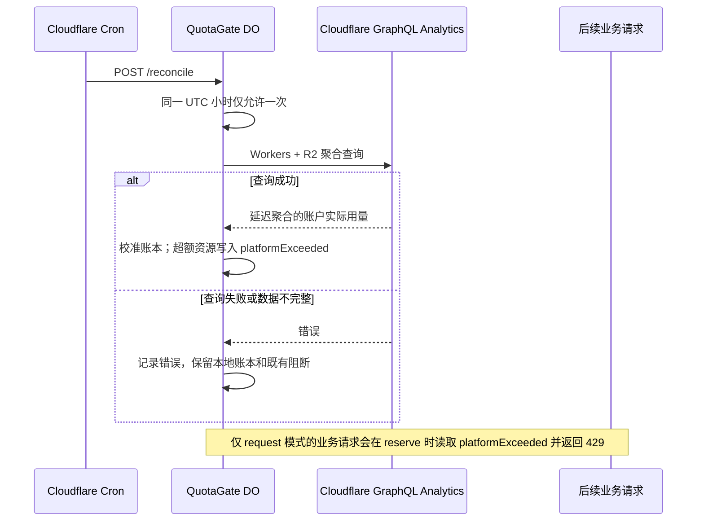
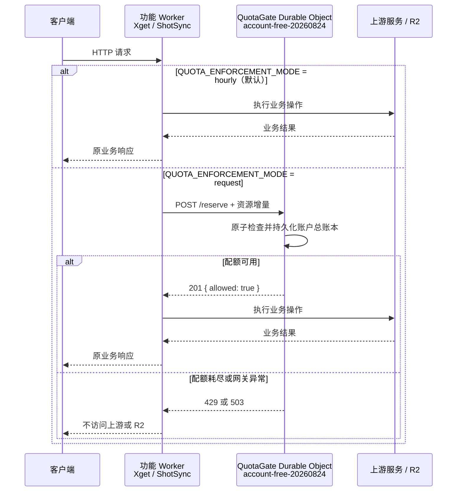

# Cloudflare 统一免费额度架构

## 当前账户账本

所有已接入的 Worker 使用同一个 Durable Object 实例和 profile：

```text
QUOTA_GATE_NAME=account-free-20260824
QUOTA_PROFILE=account
```

当前生产软上限如下：

| 资源               |                限额 | 范围     |
| ------------------ | ------------------: | -------- |
| `worker.requests`  |              50,000 | 每日     |
| `r2.storage.bytes` | 8,000,000,000 bytes | 当前存量 |
| `r2.class_a`       |             800,000 | 每月     |
| `r2.class_b`       |           8,000,000 | 每月     |

`QuotaGate` 将账本持久化在 Durable
Object 的 SQLite 存储中。每个预留请求由同一个实例串行处理，因此并发请求不能同时穿透同一上限。

## 每小时平台用量校准

`quota-gateway` 还配置了 `0 * * * *` cron。它每小时向同一个
`account-free-20260824` Durable Object 发送一次内部 `/reconcile`
请求；用户请求路径不会等待、调用或重试 GraphQL。



校准字段在 `/v1/admin/status` 的 `reconciliation` 中返回：
`lastAttemptAt`、`lastSuccessAt`、`source` 与最近 `error`。`platformExceeded`
是平台实测超过策略的资源数组；例如 `worker.requests`。它与管理员手动
`killSwitch` 独立：成功的后续校准显示实际值已回到策略内时，才会自动清除
`platformExceeded`；GraphQL 失败绝不会清除它。

GraphQL 与 Dashboard 使用同一聚合数据源，但存在数分钟延迟。因此本地预留仍是实时成本安全机制，GraphQL 仅作每小时账户总量纠偏。GraphQL 查询不执行 R2
`list()`，不消耗 R2 Class A/B 操作额度；它仍受 Cloudflare API 速率限制。

## 业务 Worker 限额模式

接入账户总账本的业务 Worker 使用 `QUOTA_ENFORCEMENT_MODE` 选择请求路径：

| 值        | 默认 | 行为                                                                         | 取舍                                                            |
| --------- | ---- | ---------------------------------------------------------------------------- | --------------------------------------------------------------- |
| `hourly`  | 是   | 不在业务请求中调用 Durable Object；仅由本 Worker cron 每小时校准平台实际用量 | 延迟最低、DO 消耗最低；Analytics 延迟窗口内不能即时阻断突发请求 |
| `request` | 否   | 每次业务请求及受控 R2 操作前调用 DO 预留                                     | 可即时阻断，但增加跨 Worker/DO 往返和 DO 免费额度消耗           |

缺失或无效值等同于 `hourly`。需要严格的实时保护时，才在对应业务 Worker 的
`[vars]` 中显式设置 `QUOTA_ENFORCEMENT_MODE = "request"`。切换模式不改变
`quota-gateway` 的 cron、共享实例名或已保存的历史账本。

`hourly` 模式中的 `platformExceeded`
是账户用量校准状态和运维告警，不会自动截获 Xget 或 ShotSync 的下一次业务请求，因为该模式故意不访问 DO。要将该状态转为每个请求的
`429`，必须切换对应 Worker 到 `request` 模式。

## 功能 Worker 请求流程



## 当前接入规则

### Xget

默认 `hourly` 模式下，`handleRequest()`
不调用 DO，直接进入缓存、路由或上游代理；账号用量由 `quota-gateway`
cron 每小时校准。

显式设置 `QUOTA_ENFORCEMENT_MODE="request"`
后，才在任何缓存、路由或上游代理之前预留一次：

```text
worker.requests +1
```

额度耗尽时返回：

```text
429 Request quota exhausted: worker.requests
```

### ShotSync

默认 `hourly` 模式下，顶层
`fetch()`、上传和删除不调用 DO；R2 实际用量由每小时 GraphQL 校准。

显式设置 `QUOTA_ENFORCEMENT_MODE="request"` 后，顶层 `fetch()`
对每个外部请求预留一次：

```text
worker.requests +1
```

上传在入口预留成功后，再预留具体 R2 资源：

```text
r2.storage.bytes + 实际文件与缩略图总字节数
r2.class_a + 1（无缩略图）或 + 2（有缩略图）
```

删除成功后释放对应的 `r2.storage.bytes`；Class
A/B 属于操作量，不会因删除而返还。ShotSync 的 R2 读取和列表路径尚未预留
`r2.class_b`，新增这类资源控制前必须在对应 R2 调用前预留。

## 新 Worker 接入

新建 Cloudflare Worker 时，在其 `wrangler.toml` 添加相同的 Durable Object
binding：

```toml
[[durable_objects.bindings]]
name = "QUOTA_GATE"
class_name = "QuotaGate"
script_name = "quota-gateway"

[vars]
QUOTA_GATE_NAME = "account-free-20260824"
QUOTA_PROFILE = "account"
QUOTA_ENFORCEMENT_MODE = "hourly" # 可选："hourly" | "request"
```

`hourly` 是默认值，不应在业务请求路径调用 DO；由 `quota-gateway`
cron 校准账户实际用量。只有需要即时、保守的本地准入控制时，才设置
`request`，并在最外层预留一次
`worker.requests`；R2、KV、D1 或 Queues 操作再预留对应资源。单个外部请求不得重复预留
`worker.requests`。

未配置 `QUOTA_GATE`
binding 的本地、Docker 或非 Cloudflare 部署应跳过预留，保持原有业务功能；Cloudflare 生产环境必须配置 binding，缺失或网关异常时应失败关闭。
