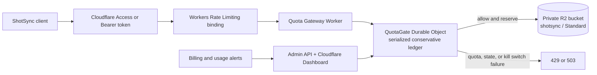
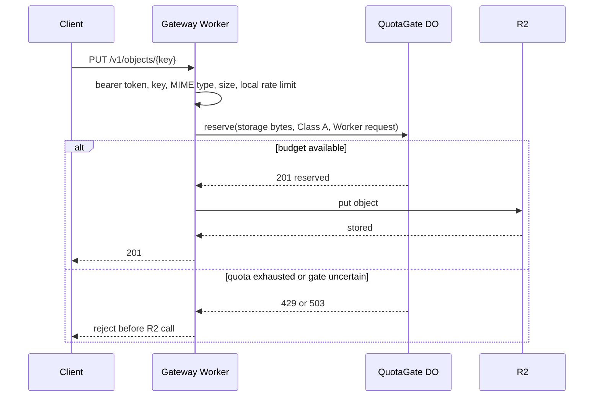

# ShotSync Free-Only Quota Gateway

This independent Cloudflare Worker exposes a private screenshot API backed by
R2. It uses a SQLite-backed Durable Object as an atomic, fail-closed admission
gate so that calls which would exceed configured Free-plan safety budgets are
rejected before R2 is called.

It does not rely on delayed invoice data. Its scope is every request routed
through this Worker; Cloudflare account owners and leaked high-privilege
credentials can bypass any application-level gate, so the deployment controls in
this document are mandatory.

## Deployment Architecture



The Durable Object stores three scopes of counters:

- `current`: current R2 storage bytes. This survives month boundaries.
- `monthly`: R2 Class A and Class B operations.
- `daily`: Worker, D1, KV, and other Free-plan guardrails.

The default limits leave headroom beneath published Free-plan limits. Adjust
them only after verifying the current pricing page for every enabled Cloudflare
product. A resource not listed in the policy is denied rather than assumed free.

## Request Flow



The reservation remains consumed once the Worker may have called R2. A timeout
therefore wastes capacity instead of risking an undercount. On a confirmed
delete, the Worker first reserves its `head()` read, then deletes the object,
and only then releases the confirmed object size.

## API

All endpoints require `Authorization: Bearer <QUOTA_GATEWAY_API_TOKEN>`.

| Method   | Path                    | Behavior                                                  |
| -------- | ----------------------- | --------------------------------------------------------- |
| `PUT`    | `/v1/objects/{key}`     | Upload a PNG, JPEG, or WebP up to 20 MB                   |
| `GET`    | `/v1/objects/{key}`     | Download an object                                        |
| `DELETE` | `/v1/objects/{key}`     | Delete an object and release confirmed storage            |
| `GET`    | `/v1/admin/status`      | View counters and kill-switch state                       |
| `POST`   | `/v1/admin/kill-switch` | Send `{ "enabled": true }` to block all object operations |

Object keys must be relative paths containing only letters, digits, `.`, `_`,
`-`, and `/`; traversal sequences are refused.

## Local Development

1. Install the repository dependencies from the repository root:

   ```powershell
   npm ci
   ```

2. Copy the example secret file and replace its value with a random secret:

   ```powershell
   Copy-Item quota-gateway/.dev.vars.example quota-gateway/.dev.vars
   ```

3. Run the isolated unit tests:

   ```powershell
   npm --prefix quota-gateway test
   ```

4. Run the Worker only against local emulated bindings. Do not use `--remote`
   for normal development:

   ```powershell
   npm --prefix quota-gateway run dev
   ```

## One-Time Cloudflare Setup

These operations change the Cloudflare account. Review the Dashboard before
running them.

1. Create a dedicated Cloudflare account for free-only projects. Do not share it
   with paid services.
2. In the Cloudflare Dashboard, enable R2 and accept the applicable terms.
   Cloudflare requires this before the bucket API is available.
3. Create the bucket with `Standard` storage only:

   ```powershell
   npx wrangler r2 bucket create shotsync --location=apac --storage-class=Standard
   ```

4. Keep the bucket private. Do not enable public `r2.dev` access or issue S3 API
   tokens to clients.
5. Configure Cloudflare Access in front of the final Worker hostname for a
   personal or team deployment. The bearer token remains a service-to-service
   control, not a substitute for user identity.
6. In Cloudflare Notifications, create a billing alert at the lowest supported
   monetary threshold. It is a kill-switch trigger, not an admission decision.

## Production Deployment

1. Review the `namespace_id` in `wrangler.toml`; it must be unique in the
   Cloudflare account if another Worker uses the native Rate Limiting binding.
2. Verify the Worker account and deployment target:

   ```powershell
   npx wrangler whoami
   ```

3. Set the production secret without committing it:

   ```powershell
   npx wrangler secret put QUOTA_GATEWAY_API_TOKEN --config quota-gateway/wrangler.toml
   ```

4. Validate that Wrangler can bundle the Worker without modifying Cloudflare:

   ```powershell
   npm --prefix quota-gateway run deploy:dry-run
   ```

5. Deploy. This applies the Durable Object SQLite migration and binds the
   existing private bucket:

   ```powershell
   npm --prefix quota-gateway run deploy
   ```

6. Add a custom Worker route only after the deployment succeeds. Protect that
   hostname with Cloudflare Access before distributing it to clients.
7. Call `GET /v1/admin/status` with the bearer token and verify that the initial
   counters are zero.
8. Upload, download, and delete one small test image. Confirm the status
   counters advance conservatively and that the bucket is still private.

## Operations and Incident Response

### Normal operation

- Review the Durable Object status daily and Cloudflare product usage weekly.
- Keep R2 lifecycle rules for screenshot retention; configure them in the R2
  Dashboard or a separately reviewed infrastructure change.
- Reject new Cloudflare product bindings until their resources and conservative
  limits are added to `DEFAULT_POLICY` or `FREE_ONLY_POLICY`.

### Billing or accounting mismatch

1. Immediately enable the kill switch:

   ```powershell
   $headers = @{ Authorization = 'Bearer <token>'; 'Content-Type' = 'application/json' }
   Invoke-RestMethod -Method Post -Uri 'https://<worker-host>/v1/admin/kill-switch' -Headers $headers -Body '{"enabled":true}'
   ```

2. Revoke any exposed Cloudflare API or R2 S3 token.
3. Compare the Durable Object status with Cloudflare Dashboard usage, identify
   the bypass or missing resource vector, and deploy the correction.
4. Only disable the kill switch after confirming that all direct paths to
   billable bindings are removed.

### Rollback

Use the Cloudflare Dashboard to roll the Worker back to the preceding version.
Do not delete the Durable Object namespace or R2 bucket as a rollback action:
that destroys the accounting state or stored screenshots. Keep the kill switch
enabled while a rollback is evaluated.

## Free-Only Limits

This project cannot make a universal Cloudflare account-level guarantee. It
provides a strict gate for traffic that reaches this Worker. To preserve that
property:

- do not give clients direct storage credentials;
- do not use console, CLI, or another Worker to write to `shotsync` outside this
  gateway;
- keep the Worker and Durable Object daily caps below their Free-plan caps;
- leave a margin below every product quota; and
- treat an unknown or unavailable counter as a hard failure.
