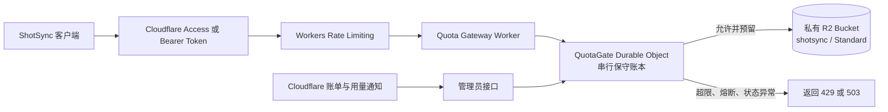
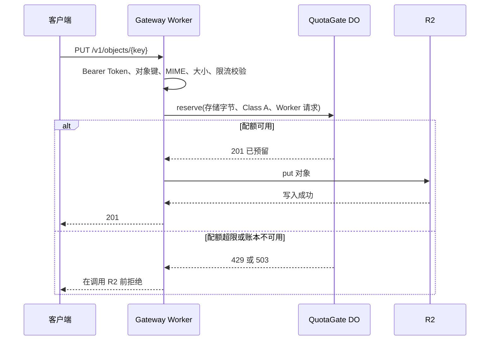
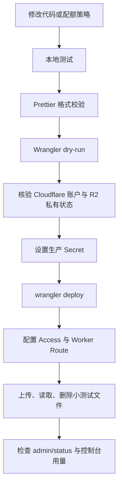

# ShotSync 免费额度安全网关

本目录是一个独立的 Cloudflare
Worker。它为私有截图存储提供统一入口：请求在访问 R2 前，必须先通过 SQLite-backed
Durable
Object 的原子配额检查；达到安全配额、熔断已开启或账本不可用时，请求会在调用 R2 前被拒绝。

它不依赖延迟的账单金额做实时决策，而是用本地“最坏情况预留账本”防止受控流量超出免费额度。

此外，Worker cron 每小时读取一次 Cloudflare Dashboard 同源的 GraphQL
Analytics 聚合数据，校准账户实际 Workers 请求、R2 存储和 R2 操作量。此校准不在用户请求路径上执行：GraphQL 失败时继续使用本地保守账本；平台实测超额时会持久化具体资源的
`platformExceeded` 状态。只有逐请求的 `request` 模式会在后续预留时将该状态返回为
`429`。

默认情况下，Xget 与 ShotSync 使用
`QUOTA_ENFORCEMENT_MODE="hourly"`，不再在每个业务请求中向 DO 预留额度，因此代理路径不增加 DO 往返。若必须在 GraphQL 聚合延迟窗口内即时拒绝，请显式改为
`request`；该模式会增加每请求 DO 使用量。

因此，`hourly` 的 `platformExceeded` 是告警和运维决策信号，并不会自动拦截 Xget/
ShotSync 请求；需要自动返回 `429` 时必须切换到 `request`。

> 适用边界：该网关只能保护经过它的流量。Cloudflare 账户 Owner 在控制台直接操作、泄露的高权限 API
> Token、直接 R2 S3
> Token，均可能绕过应用层配额。因此本文的权限与部署约束必须同时执行。

## 一、部署架构



组件职责如下：

| 组件                         | 作用                                        | 失败时的处理                     |
| ---------------------------- | ------------------------------------------- | -------------------------------- |
| `Quota Gateway Worker`       | 验证身份、请求参数、限流、调用配额闸门和 R2 | 返回 `503`，绝不绕过闸门直连 R2  |
| `QuotaGate` Durable Object   | 原子预留配额、保存使用状态、全局熔断        | 状态异常则拒绝所有请求           |
| Workers Rate Limiting        | 限制单用户/单服务令牌的突发流量             | 返回 `429`                       |
| R2                           | 保存私有截图对象                            | 仅由 Gateway Worker binding 访问 |
| Billing Notifications        | 发现账单异常后的兜底告警                    | 管理员开启全局熔断               |
| Cloudflare GraphQL Analytics | 每小时读取 Dashboard 聚合用量并校准账本     | 记录失败，继续使用本地账本       |

## 二、请求与记账流程



账本有三种作用域：

- `current`：当前 R2 已保留的存储字节，不会因跨月自动清零。
- `monthly`：R2 Class A 与 Class B 操作次数。
- `daily`：Worker、KV、D1 等服务的日限额。

一旦 Worker 可能已调用 R2，预留额度不会自动回滚。例如 R2 请求超时，系统宁可浪费少量免费额度，也不低估真实消耗。确认删除对象后，Worker 才会释放已确认的对象字节数。

上述逐请求预留仅在 `QUOTA_ENFORCEMENT_MODE="request"` 时启用。生产默认 `hourly`
模式仅使用 GraphQL 每小时校准，因此不维护逐请求本地使用量；请依据
`reconciliation.lastSuccessAt`、`reconciliation.error` 与 `platformExceeded`
判断校准健康度。

## 三、默认安全额度

默认策略保留了 Cloudflare 免费额度余量，避免计量差异、重试和后台操作导致超额。所有未登记资源默认拒绝。

| 资源                  | 默认安全上限 | 说明                      |
| --------------------- | -----------: | ------------------------- |
| R2 当前 Standard 存储 |         8 GB | 低于 10 GB-month 免费额度 |
| R2 Class A            |   600,000/月 | 上传等写操作              |
| R2 Class B            | 2,000,000/月 | 读取与 `head()` 操作      |
| Worker 请求           |    60,000/天 | 低于 Workers Free 日额度  |
| KV 读取               |    60,000/天 | 仅为后续接入 KV 预留      |
| KV 写入/list          |       700/天 | 仅为后续接入 KV 预留      |
| D1 读行数             | 3,000,000/天 | 仅为后续接入 D1 预留      |
| D1 写行数             |    60,000/天 | 仅为后续接入 D1 预留      |

当前 Worker 只调用 R2。若接入 D1、KV、Queues、Workers
AI、Images、Stream 等产品，必须先为每个具体操作增加资源向量和保守配额；不能只因为策略中存在一个名称就直接开放对应 binding。

## 四、接口说明

所有接口必须携带：

```http
Authorization: Bearer <QUOTA_GATEWAY_API_TOKEN>
```

| 方法     | 路径                    | 说明                                         |
| -------- | ----------------------- | -------------------------------------------- |
| `PUT`    | `/v1/objects/{key}`     | 上传 PNG、JPEG 或 WebP，最大 20 MB           |
| `GET`    | `/v1/objects/{key}`     | 下载对象                                     |
| `DELETE` | `/v1/objects/{key}`     | 删除对象并释放确认的存储空间                 |
| `GET`    | `/v1/admin/status`      | 查看当前账本与熔断状态                       |
| `POST`   | `/v1/admin/kill-switch` | 传入 `{ "enabled": true }`，停止所有对象操作 |

对象键只能包含字母、数字、`.`、`_`、`-` 和 `/`；拒绝绝对路径、`..`
和非法 URL 编码。

## 五、本地开发流程

1. 在仓库根目录安装依赖：

   ```powershell
   npm ci
   ```

2. 创建本地密钥文件。该文件已被 Git 忽略，不能提交真实密钥：

   ```powershell
   Copy-Item quota-gateway/.dev.vars.example quota-gateway/.dev.vars
   ```

3. 编辑 `quota-gateway/.dev.vars`，生成高熵 `QUOTA_GATEWAY_API_TOKEN`。

4. 运行独立测试：

   ```powershell
   npm --prefix quota-gateway test
   ```

5. 仅启动本地模拟 binding：

   ```powershell
   npm --prefix quota-gateway run dev
   ```

日常开发不要使用
`wrangler dev --remote`，否则本地测试可能消耗生产 R2 或其他远程资源。

## 六、一次性账户初始化

以下步骤会改变 Cloudflare 账户状态，执行前应确认使用的是专门的免费项目账户。

1. 创建独立 Cloudflare 账户，不和现有付费服务共用。
2. 在 Cloudflare Dashboard 启用 R2，并接受页面提示的服务条款。
3. 创建 `Standard` 存储类型的 bucket：

   ```powershell
   npx wrangler r2 bucket create shotsync --location=apac --storage-class=Standard
   ```

4. 保持 bucket 私有：不要启用 `r2.dev` 公网访问，不要给客户端签发 R2 S3 API
   Token。
5. 为最终 Worker 域名配置 Cloudflare
   Access。个人或团队使用应优先限制为指定邮箱、身份提供方或 Service Token。
6. 在 Cloudflare Notifications 中创建最低可用金额阈值的 Billing
   Alert。它只能作为异常告警，不能作为实时拒绝条件。

## 七、生产部署流程



具体命令：

1. 检查登录账户：

   ```powershell
   npx wrangler whoami
   ```

2. 检查 [wrangler.toml](/E:/linshi/xget/quota-gateway/wrangler.toml) 的
   `namespace_id`。它在同一 Cloudflare 账户中必须唯一；若其他 Worker 已占用，请修改后再部署。

3. 设置生产密钥，不将其写入代码或仓库：

   ```powershell
   npx wrangler secret put QUOTA_GATEWAY_API_TOKEN --config quota-gateway/wrangler.toml
   npx wrangler secret put CLOUDFLARE_ACCOUNT_ID --config quota-gateway/wrangler.toml
   npx wrangler secret put CLOUDFLARE_ANALYTICS_API_TOKEN --config quota-gateway/wrangler.toml
   ```

   `CLOUDFLARE_ANALYTICS_API_TOKEN`
   必须是单独创建的最小权限只读 Token，仅授予当前账户在 Dashboard 可用的 Analytics
   / Account Analytics
   Read 权限；不要复用可部署、可编辑 R2 或 Owner 权限的 Token。`CLOUDFLARE_ACCOUNT_ID`
   是当前账户 ID，作为 secret 保存可避免它出现在部署配置。部署后先执行一次受控 cron，检查
   `/v1/admin/status` 的 `reconciliation.source` 是否为 `cloudflare-graphql`。

4. 预演打包，不修改远程资源：

   ```powershell
   npm --prefix quota-gateway run deploy:dry-run
   ```

5. 执行部署。该步骤会部署 Worker、应用 Durable Object SQLite
   migration，并绑定已创建的 R2 bucket：

   ```powershell
   npm --prefix quota-gateway run deploy
   ```

6. 部署成功后再绑定自定义域名和 Cloudflare
   Access，确认 Access 生效后才分发给客户端。

7. 使用管理员令牌调用
   `/v1/admin/status`，确认计数初始为零；随后上传、下载、删除一张小图片，确认计数符合预期。

## 八、熔断与故障处理

以下情况应立即开启熔断：

- Billing Alert 显示任何非零费用。
- Cloudflare 控制台用量大于 Durable Object 内部账本。
- 发现泄露的 API Token、S3 Token 或未受控 Worker binding。
- 配额策略损坏、QuotaGate 无法访问或审计任务长期异常。

通过 PowerShell 开启熔断：

```powershell
$headers = @{
  Authorization = 'Bearer <token>'
  'Content-Type' = 'application/json'
}

Invoke-RestMethod -Method Post `
  -Uri 'https://<worker-host>/v1/admin/kill-switch' `
  -Headers $headers `
  -Body '{"enabled":true}'
```

开启后，外部对象请求返回 `503` 和 `Retry-After: 86400`。处理顺序：

1. 保持熔断。
2. 立即撤销泄露的 Cloudflare API Token、R2 S3 Token 或 Access Service Token。
3. 对照 Dashboard 用量和 `/v1/admin/status` 查找旁路或缺失的资源向量。
4. 修复后部署新版本并复核。
5. 只有确认所有调用都重新经过网关后，才关闭熔断。

## 九、回滚原则

在 Cloudflare Dashboard 中回滚到上一个 Worker 版本。回滚期间保持熔断开启。

不要把删除 R2 bucket 或 Durable Object
namespace 当作回滚方式：前者会删除截图，后者会删除配额账本，都会增加恢复风险。

## 十、免费额度安全清单

- [ ] R2 为 `Standard`，未使用 `InfrequentAccess`。
- [ ] `shotsync` bucket 保持私有。
- [ ] 客户端没有 Cloudflare API Token 或 R2 S3 Token。
- [ ] 所有对象请求只进入本 Worker。
- [ ] Access 已保护生产域名。
- [ ] Worker 和 Durable Object 日配额低于 Free 计划上限。
- [ ] 每种已启用 Cloudflare 服务都有资源向量和保守配额。
- [ ] 未登记服务默认拒绝。
- [ ] Billing Alert 已启用。
- [ ] `CLOUDFLARE_ANALYTICS_API_TOKEN` 为独立、最小权限只读 Token。
- [ ] `/v1/admin/status` 中 `reconciliation.lastSuccessAt` 在最近两小时内，且
      `platformExceeded` 为空。
- [ ] 熔断接口和 Token 撤销流程已演练。

本方案以“保守拒绝”换取成本安全：可能因超时、失败或预留未释放而提前停止服务，但不会因为不确定的计量状态继续调用计费资源。
